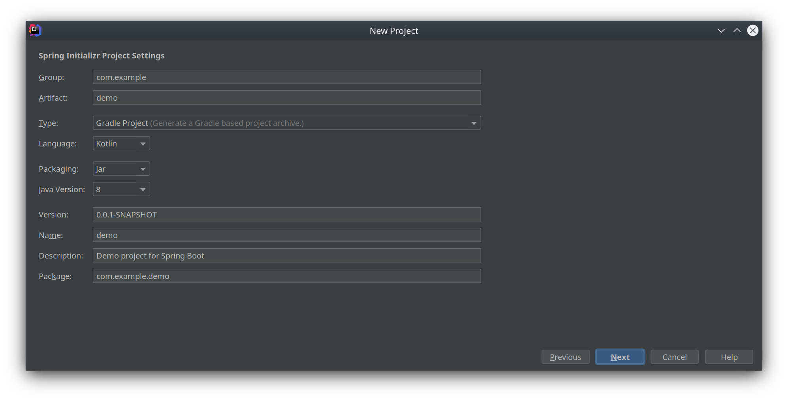
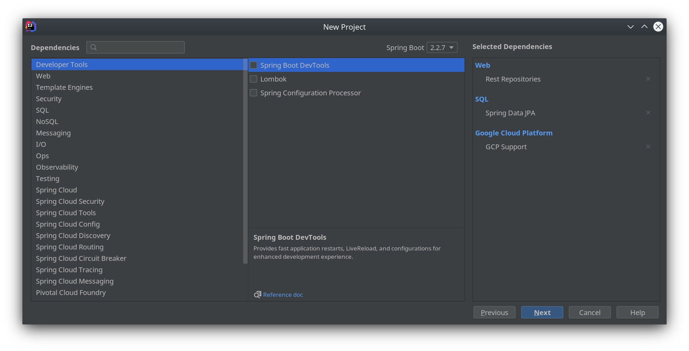
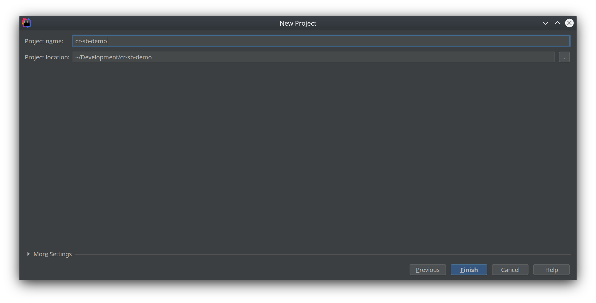
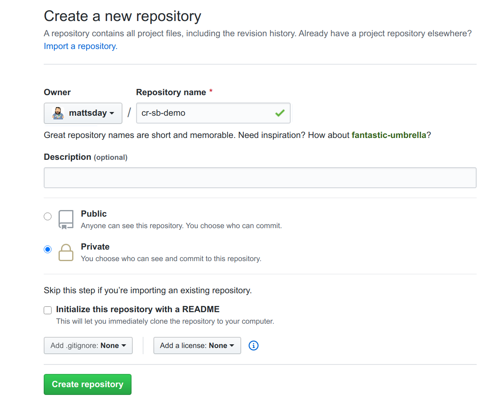
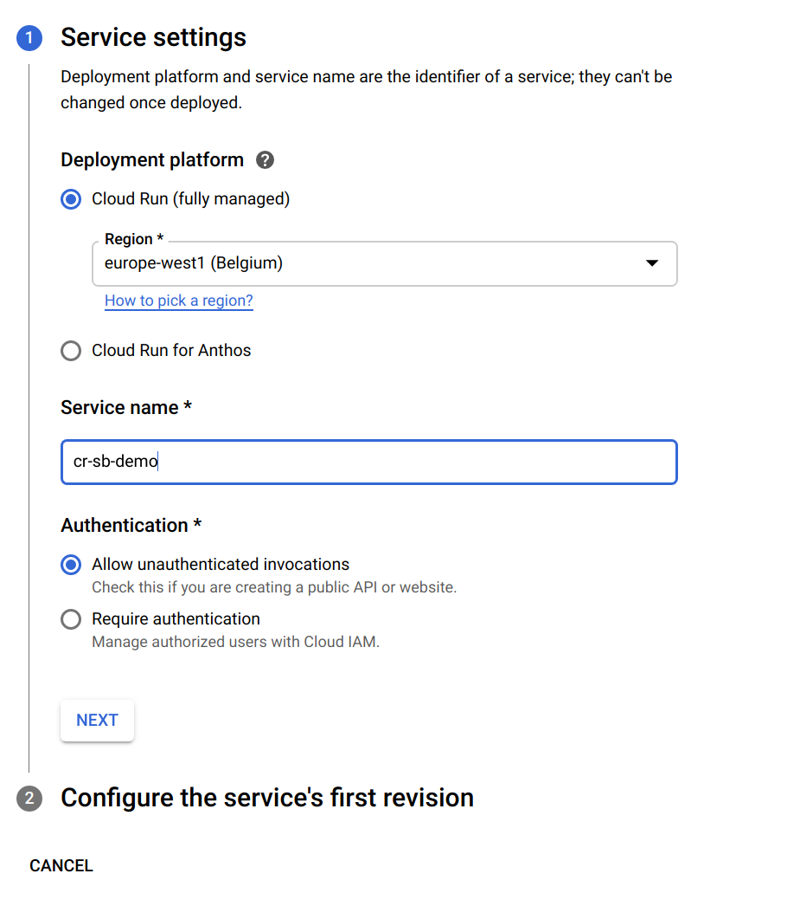
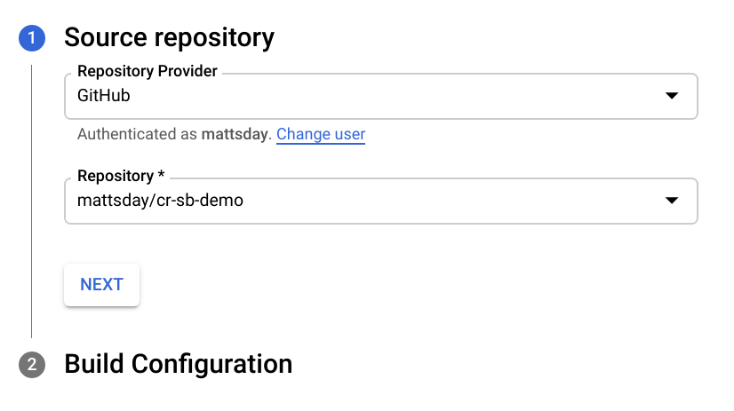
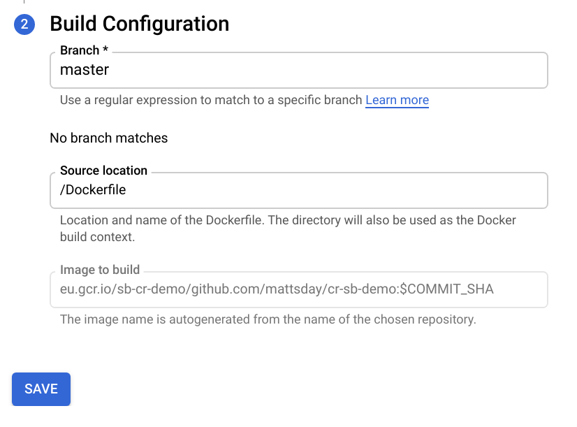
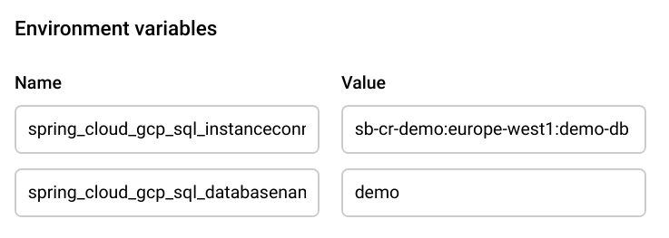

# Cloud Run Spring Boot Demo

This demo shows a Cloud Run app written in Spring Boot connected to Cloud SQL via the proxy connector.

It is designed for you to be able to code it "live" if you like to show the full developer workflow.

**Note: You can just fork this repo and use this if you don't wanna do any coding**

## Overview

This demo will take you through the following steps

1. Write a small Spring Boot Kotlin application
2. Push your app to source control
3. Use continuous deployment in Cloud Run to deploy your workload
4. Connect your app to a database
5. Refine your app and push changes

### Assumptions

This guide assumes you're using [JetBrains IntelliJ IDEA](https://www.jetbrains.com/idea/) - any IDE (or even CLI) is possible though! 

## Step 0. Pre-Requisites

### Log in to GCP

If you're not using Cloud Shell ensure you are logged in to GCP

```shell script
gcloud auth login
```

### Enable APIs
```shell script
GCP_PROJECT=<my-project>

gcloud services enable run.googleapis.com cloudbuild.googleapis.com sql-component.googleapis.com sourcerepo.googleapis.com sqladmin.googleapis.com --project "$GCP_PROJECT"
```

### Cloud SQL Database

#### Create the DB

Create a Cloud SQL database for your project

```shell script
DB_INSTANCE_NAME=demo-db
DB_ZONE=europe-west1-b
DB_TIER=db-f1-micro
gcloud sql instances create "$DB_INSTANCE_NAME" --project "$GCP_PROJECT" --zone "$DB_ZONE" --tier "$DB_TIER"
```

#### Import Dummy Data

Import some dummy data to the database

```shell script
gcloud sql import sql "$DB_INSTANCE_NAME" gs://sb-cr-demo/demo.sql --project "$GCP_PROJECT" --quiet
```

## Step 1. Creating IntelliJ Project and App

Create a new Project by clicking through **File** -> **New** -> **Project** and select **Spring Initializr**


Change the type to **Gradle Project** and the language to **Kotlin**



Make sure you select Spring Boot **2.2.x** as GCP does not currently work with 2.3.x

Add the following dependencies (use the search field):

1. Rest Repositories
2. Spring Data JPA
3. GCP Support



Give your project a name and select a location before clicking **finish**



## Step 2. Add MySQL Connector

We haven't told our app how to connect to MySQL yet. To do this open **build.gradle.kts** and add the following to the dependencies section:

```kotlin
implementation("org.springframework.cloud:spring-cloud-gcp-starter-sql-mysql")
```

The whole section should look like this:
```kotlin
dependencies {
    implementation("org.springframework.boot:spring-boot-starter-data-jpa")
    implementation("org.springframework.boot:spring-boot-starter-data-rest")
    implementation("com.fasterxml.jackson.module:jackson-module-kotlin")
    implementation("org.jetbrains.kotlin:kotlin-reflect")
    implementation("org.jetbrains.kotlin:kotlin-stdlib-jdk8")
    implementation("org.springframework.cloud:spring-cloud-gcp-starter-sql-mysql")
    implementation("org.springframework.cloud:spring-cloud-gcp-starter")
    testImplementation("org.springframework.boot:spring-boot-starter-test") {
        exclude(group = "org.junit.vintage", module = "junit-vintage-engine")
    }
}
```

## Step 3. Writing some code

Open the file **DemoApplication.kt** (under `src/main/kotlin/com/example/demo`)

Create a Kotlin data class to represent a customer record - these represent the data in the dummy database

```kotlin
@Entity
data class Customer(@Id @GeneratedValue val id: Long, val name: String, val address: String)
```

Finally create a repo to store and address the data
```kotlin
interface CustomerRepo : JpaRepository<Customer, Long> {
}
```

Your app should look like this:

```kotlin
package com.example.demo

import org.springframework.boot.autoconfigure.SpringBootApplication
import org.springframework.boot.runApplication
import org.springframework.data.jpa.repository.JpaRepository
import javax.persistence.Entity
import javax.persistence.GeneratedValue
import javax.persistence.Id

@SpringBootApplication
class DemoApplication

fun main(args: Array<String>) {
    runApplication<DemoApplication>(*args)
}

@Entity
data class Customer(@Id @GeneratedValue val id: Long, val name: String, val address: String)

interface CustomerRepo : JpaRepository<Customer, Long> {
}
```
## Step 4. Dockerfile

Click **File** -> **New** -> **File** and call it `Dockerfile`

This Dockerfile will also compile your app - there are other/better ways to do this but this keeps the app/demo simple!

```dockerfile
FROM gradle:latest AS build
COPY . /home/gradle/src
WORKDIR /home/gradle/src
RUN gradle assemble

FROM openjdk:8
COPY --from=build /home/gradle/src/build/libs/demo-0.0.1-SNAPSHOT.jar /app.jar
ENTRYPOINT ["java", "-jar", "/app.jar"]
```

## Step 5. Store in Git and push

I'm using github for this, but you can use Cloud Source Repositories if you like or anything else Cloud Run supports.

In a shell open your workspace and initialise a git project:

```shell script
git init
git add .gitignore *
git commit -m "Initial commit"
```

Create a new repository in Github called whatever you like, for example:



On github copy the instructions to push from an existing repo.

## Step 6. Cloud Run

In the cloud console navigate to Cloud Run in your project with the SQL database and click **Create Service**

Pick a region and give your service a name, allowing unauthenticated requests.



On the next screen select **Continuously deploy new revisions from source repository** and click **Set up with Cloud Build**.

Authenticate with GitHub and select your repository.



Leave the default configuration to run from the Dockerfile and save it



Expand **Advanced Settings** and allocate 2 vCPUs and 512MiB Memory - Java can be slow and this helps!  The Cloud Run team are working on optimising Java in the future.


On the **Variables** tab create new environment variables:

|  Name                                         | Value                               |
|-----------------------------------------------|-------------------------------------|
| `spring_cloud_gcp_sql_instanceconnectionname` | `<project ID>:europe-west1:demo-db` |
| `spring_cloud_gcp_sql_databasename`           | `demo`                              |



On the **Connections** tab select your MySQL instance


Now click **Create** and Cloud Build will build a container image and serve it for you.

This takes a while - around 2-4 minutes - and is a good time to walk through the Cloud Build UI and talk about its features

Once it's up, navigate to its URL and add `/customers` to the end. You should get output like this:

```json
{
  "_embedded" : {
    "customers" : [ {
      "name" : "Derek Wintheiser",
      "address" : "Apt. 486 584 Latashia Camp, Kerlukeport, FL 25476",
      "_links" : {
        "self" : {
          "href" : "http://cr-sb-demo-24ucbo6mha-ew.a.run.app/customers/1"
        },
        "customer" : {
          "href" : "http://cr-sb-demo-24ucbo6mha-ew.a.run.app/customers/1"
        }
      }
    } ]
  }
}
```

# Step 6. Improving Search

We can use Spring Boot to provide a simple search interface. Edit the repository interface to look like this:

```kotlin
interface CustomerRepo : JpaRepository<Customer, Long> {
    fun findByNameContainingIgnoreCase(name: String): List<Customer>
}
```

Breaking this down we're asking to find a customer by name containing our search query and to ignore case. Save the file and commit to source control:

```shell script
git commit -am "Added customer name search" && git push
```

This should trigger a new cloud build. Going to your URL `/search` once it's finished should give you a search interface.

## Conclusion

This should show you how quickly you can get up and running with a deployment pipeline in Cloud Run and write code that starts to work on your business logic with Spring Boot + Spring Boot GCP.

Note how we haven't used any usernames or passwords - it's all through service accounts and the Cloud SQL connector!